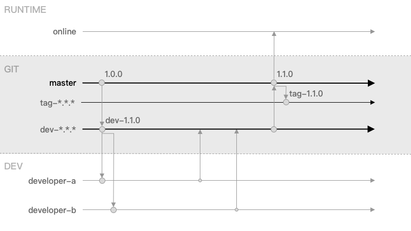

# Git 规范

## 版本号
采用三位版本号例如：`dev-2.1.3`：

* `dev`：版本那些，代表开发版本，可能会有`alpha`、`tag`等；
* `2.x.x`：第一位版本号，代表大版本号，如果整个项目改版、技术整体重构等大型的改进升级，第一位版本号会加`+1`；
* `x.1.x`：第二位版本号，代表小版本号，每个迭代周期新增功能，或者旧功能的改进，第二位版本号会加`+1`；
* `x.x.3`：第三位版本号，代表Hotfix本号，上线后的版本如果出现 Bugs 需要紧急修复，每次修复第三位版本号会加`+1`；

示例：`dev-1.0.0`、`dev-1.2.23`、`tag-1.3.0`。

## 开发流程

### 快捷流程
适合`4`人以下开发同一个项目的小团队，并且尽可能少的存在多人开发同一个模块或者功能。尽量少开分支，多人在同一个开发分支上开发，减少代码 `merge` 的流程，由于同一个模块多人开发的情况少这样解决冲突的情况也变得更少了。当然上线还是通过 `master` 分支上线。

代码分支：
* `master` 主分支
* `tag-*.*.*` Tag
* `dev-*.*.*` 开发分支

开发流程：

### 完整流程
适合超过`8`人的中大团队，尽可能多的开发分支，确保代码可靠、安全、可回溯，有专门的 `merge` 代码的流程，会有大量的冲突需要专业人员来解决。这是一个完整、保证代码质量、避免代码丢失的代码管理流程，它看似繁琐，但是在大型团队中会避免诸多风险，它稳健代码管理风格让项目进展得更加长远。

代码分支：
* `master` 主分支
* `tag-*.*.*` Tag
* `hotfix-*.*.*` Hotfix 分支
* `dev-*.*.*` 开发分支
* `dev-*.*.*-module1` 功能模块开发分支1
* `dev-*.*.*-module2` 功能模块开发分支2
* ...

TODO